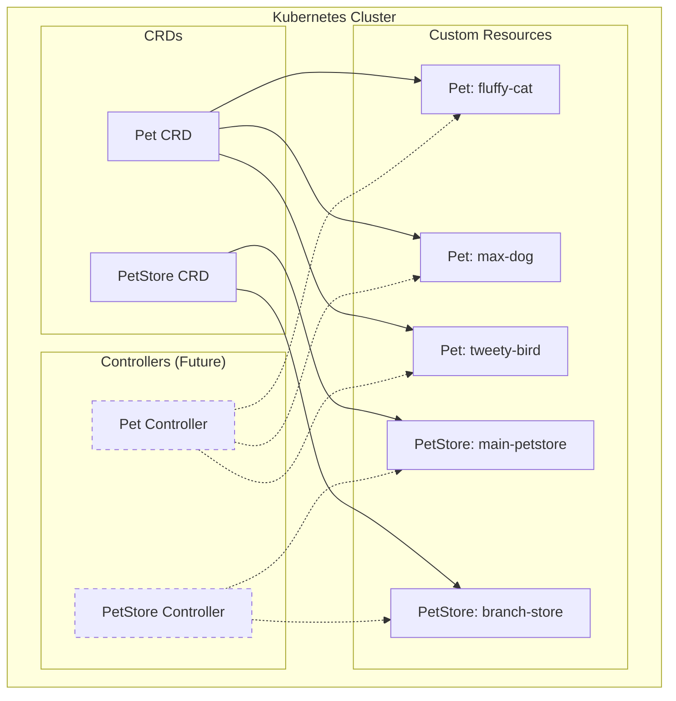

# PetStore Kubernetes CRDs

Welcome to the **PetStore Kubernetes CRDs** documentation! This project provides Custom Resource Definitions (CRDs) that model the data structures from the Swagger Petstore OpenAPI specification, enabling you to manage pets and pet stores as native Kubernetes resources.

## :material-rocket: Quick Start

Get up and running with PetStore CRDs in minutes:

```bash
# Install the CRDs
kubectl apply -f crds/

# Create a namespace for examples
kubectl create namespace petstore-demo

# Apply example resources
kubectl apply -f examples/
```

## :material-file-tree: What's Included

### Resources

- **:material-cat: Pet**: Individual pet resources with ID, name, and optional tags
- **:material-store: PetStore**: Pet store management resources with configuration, endpoints, and security settings

### Features

- :material-shield-check: **Comprehensive Validation**: OpenAPI v3 schema validation for all fields
- :material-table: **Custom Columns**: Enhanced `kubectl get` output with useful information
- :material-code-tags: **Rich Examples**: Complete example resources for testing and learning
- :material-book-open: **Full Documentation**: Comprehensive guides and references

## :material-map: Architecture Overview



## :material-lightning-bolt: Key Benefits

### Native Kubernetes Integration
Manage pets and pet stores using standard Kubernetes tools and APIs.

### Rich Validation
Comprehensive OpenAPI v3 schema validation ensures data integrity and consistency.

### Extensible Design
Built with future controllers and operators in mind for automated management.

### Production Ready
Follows Kubernetes best practices with proper status reporting and conditions.

## :material-play: Getting Started

Choose your path:

=== "Quick Start"
    
    Jump right in with our [Quick Start Guide](getting-started/quick-start.md) to get the CRDs running in minutes.

=== "Installation"
    
    Follow our detailed [Installation Guide](getting-started/installation.md) for production deployments.

=== "Examples"
    
    Explore the [Examples](resources/examples.md) to see different configurations and use cases.

## :material-information: What's Next?

- **Learn the Resources**: Understand the [Pet CRD](resources/pet-crd.md) and [PetStore CRD](resources/petstore-crd.md)
- **Explore Usage**: See how to [manage pets](usage/managing-pets.md) and [stores](usage/managing-stores.md)
- **Check the Reference**: Browse the complete [API Reference](reference/api-reference.md)
- **Contribute**: Help us improve by following our [Contributing Guidelines](contributing/guidelines.md)

## :material-github: Source Code

The complete source code is available on GitHub:

[:fontawesome-brands-github: View on GitHub](https://github.com/username/kubernetes-objects){ .md-button .md-button--primary }

## :material-help-circle: Need Help?

- :material-book: Check out our comprehensive documentation
- :material-bug: Report issues on [GitHub Issues](https://github.com/username/kubernetes-objects/issues)
- :material-email: Contact us via [email](mailto:contact@example.com)

---

!!! tip "Pro Tip"
    Start with the [Quick Start Guide](getting-started/quick-start.md) to get hands-on experience before diving into the detailed documentation.